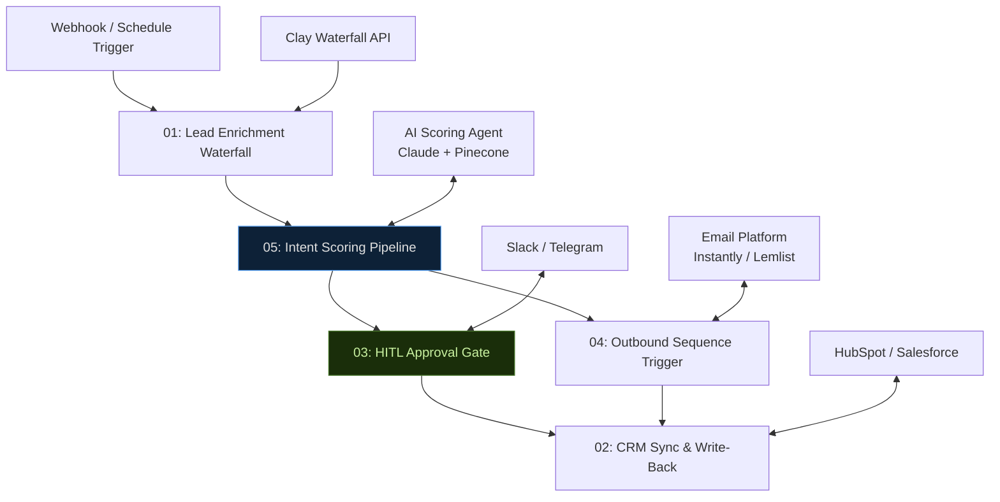

# n8n Revenue Automation — Production Workflow Library
**myAutoBots.AI | Sammy Samet, Principal Technologist**

> A production-tested library of n8n workflows for B2B revenue automation. Each workflow is battle-tested, includes a Mermaid architecture diagram, full node-by-node documentation, and integration notes.

📅 [Book a free 30-min revenue diagnostic](https://calendly.com/ssam8005/30min) · 🌐 [myautobots.ai](https://myautobots.ai) · 🚀 [Neural-GTM Sprint](https://github.com/ssam8005/neural-gtm-sprint)

---

## What's In This Library

| # | Workflow | Use Case | Complexity |
|---|---|---|---|
| 01 | [Lead Enrichment Waterfall](workflows/01-lead-enrichment-waterfall.md) | Auto-enrich new leads via Clay multi-provider cascade | ⚡⚡ Medium |
| 02 | [CRM Sync & Write-Back](workflows/02-crm-sync-write-back.md) | Bi-directional HubSpot/Salesforce sync with enrichment data | ⚡⚡ Medium |
| 03 | [HITL Approval Gate](workflows/03-hitl-approval-gate.md) | Human-in-the-loop review for high-stakes automated actions | ⚡⚡⚡ Advanced |
| 04 | [Outbound Sequence Trigger](workflows/04-outbound-sequence-trigger.md) | Auto-enroll scored leads in tiered email sequences | ⚡⚡ Medium |
| 05 | [Intent Scoring Pipeline](workflows/05-intent-scoring-pipeline.md) | Score and tier leads 0–100 using enrichment + AI reasoning | ⚡⚡⚡ Advanced |

---

## Architecture Overview

All workflows operate as coordinated components within a single orchestration layer:

---

## Stack Requirements

- **n8n** v1.x+ (self-hosted or cloud)
- **Clay** account with API access
- **HubSpot** or **Salesforce** with API credentials
- **Pinecone** index (for workflow 05 AI scoring)
- **Slack** or **Telegram** bot (for HITL notifications)
- **Python** 3.10+ (for AI agent webhook receiver — see [agentic-lead-scoring](https://github.com/ssam8005/agentic-lead-scoring))

---

## Workflow JSON Exports

All 5 production workflow JSON exports are live in the [`workflows/`](./workflows/) folder — importable directly into any n8n instance. Credentials have been sanitized and replaced with named credential references.

**Import any workflow in 60 seconds:**
1. Open your n8n instance → **Workflows → Import from file**
2. Upload the `.json` file
3. Reconnect credentials in each node (names are pre-labeled)
4. Activate and test

| Workflow | JSON | Docs |
|---|---|---|
| 01 Lead Enrichment Waterfall | [Download](./workflows/01-lead-enrichment-waterfall.json) | [Docs](./workflows/01-lead-enrichment-waterfall.md) |
| 02 CRM Sync & Write-Back | [Download](./workflows/02-crm-sync-write-back.json) | [Docs](./workflows/02-crm-sync-write-back.md) |
| 03 HITL Approval Gate | [Download](./workflows/03-hitl-approval-gate.json) | [Docs](./workflows/03-hitl-approval-gate.md) |
| 04 Outbound Sequence Trigger | [Download](./workflows/04-outbound-sequence-trigger.json) | [Docs](./workflows/04-outbound-sequence-trigger.md) |
| 05 Intent Scoring Pipeline | [Download](./workflows/05-intent-scoring-pipeline.json) | [Docs](./workflows/05-intent-scoring-pipeline.md) |

---

## Related Repos

- [neural-gtm-sprint](https://github.com/ssam8005/neural-gtm-sprint) — Full methodology, SOW, case studies
- [agentic-lead-scoring](https://github.com/ssam8005/agentic-lead-scoring) — Python AI scoring agent called by workflow 05

---

*Built by [Sammy Samet](https://linkedin.com/in/ssamet) — Principal Technologist, [myAutoBots.AI](https://myautobots.ai)*
