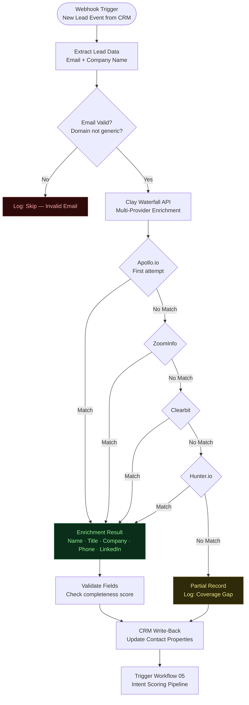

# Workflow 01: Lead Enrichment Waterfall
**n8n Revenue Automation Library | myAutoBots.AI**

Auto-enriches every new lead entering the CRM using a Clay multi-provider waterfall cascade. Fires on webhook or schedule, runs enrichment, writes results back to CRM within 90 seconds of trigger.

---

## Flow Diagram



---

## Node Reference

| # | Node | Type | Purpose |
|---|---|---|---|
| 1 | Webhook Trigger | Webhook | Receives new lead event from CRM (HubSpot/Salesforce webhook) |
| 2 | Extract Lead Data | Function | Parses email, domain, company name from payload |
| 3 | Email Validation | IF | Skips free email domains (gmail, yahoo, hotmail) and malformed addresses |
| 4 | Clay HTTP Request | HTTP Request | POST to Clay API — waterfall config ID + lead data |
| 5 | Provider Check — Apollo | IF | Checks `match_provider === 'apollo'` |
| 6 | Provider Check — ZoomInfo | IF | Falls through if Apollo miss |
| 7 | Provider Check — Clearbit | IF | Falls through if ZoomInfo miss |
| 8 | Provider Check — Hunter | IF | Falls through if Clearbit miss |
| 9 | Enrich Result | Set | Normalizes enrichment fields to standard schema |
| 10 | Validate Fields | Function | Calculates completeness score (0–100); flags partial records |
| 11 | CRM Write-Back | HubSpot / Salesforce node | Updates contact properties with enrichment data + completeness score |
| 12 | Trigger Workflow 05 | HTTP Request | POST to Workflow 05 webhook to initiate scoring |

---

## CRM Properties Written

| Property | Source | Notes |
|---|---|---|
| `enriched_name` | Waterfall result | Full name |
| `enriched_title` | Waterfall result | Job title |
| `enriched_phone` | Waterfall result | Direct dial preferred |
| `enriched_linkedin` | Waterfall result | Profile URL |
| `company_size` | Waterfall result | Employee count range |
| `company_industry` | Waterfall result | Standardized industry tag |
| `enrichment_provider` | n8n | Which provider matched |
| `enrichment_completeness` | Calculated | 0–100 completeness score |
| `enrichment_date` | n8n | ISO timestamp |

---

## Configuration

```json
{
  "clay_api_key": "{{ $env.CLAY_API_KEY }}",
  "clay_waterfall_table_id": "{{ $env.CLAY_TABLE_ID }}",
  "crm_type": "hubspot",
  "skip_domains": ["gmail.com", "yahoo.com", "hotmail.com", "outlook.com"],
  "min_completeness_score": 60,
  "trigger_scoring_on_complete": true
}
```

---

## Performance Benchmarks

| Metric | Value |
|---|---|
| Average enrichment latency | 4–8 seconds |
| End-to-end trigger-to-CRM-write | <90 seconds |
| Match rate on B2B ICP leads | 89–91% |
| Cost per enriched record (waterfall) | ~$0.08 average |
| Cost per enriched record (single provider) | $0.15–$0.28 |

---

*Part of the [Neural-GTM Sprint](https://github.com/ssam8005/neural-gtm-sprint) methodology.*
*[Book a free discovery call](https://calendly.com/ssam8005/30min)*
