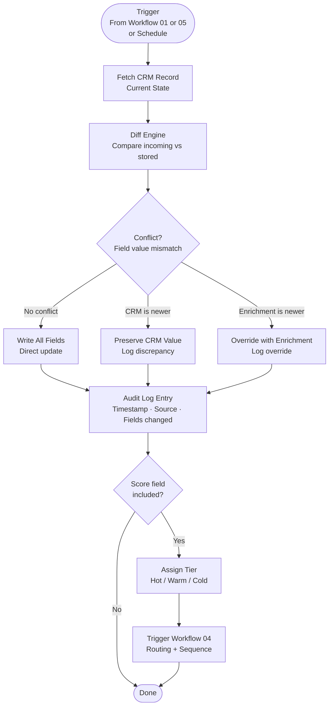

# Workflow 02: CRM Sync & Write-Back
**n8n Revenue Automation Library | myAutoBots.AI**

Bi-directional sync between the enrichment pipeline and CRM. Writes enrichment data, lead scores, tier assignments, and stage changes. Handles conflict resolution and audit logging.

---

## Flow Diagram



---

## Node Reference

| # | Node | Type | Purpose |
|---|---|---|---|
| 1 | Trigger | Webhook / Schedule | Receives update payload from enrichment or scoring workflows |
| 2 | Fetch CRM Record | HubSpot / Salesforce | Gets current field values for conflict resolution |
| 3 | Diff Engine | Function | Compares incoming fields vs stored; identifies conflicts |
| 4 | Conflict Resolution | Switch | Routes to preserve, override, or direct-write branches |
| 5 | CRM Update | HubSpot / Salesforce | Patches contact/deal with resolved field values |
| 6 | Audit Logger | Function + Airtable | Logs every field change with timestamp, source, and actor |
| 7 | Tier Assignment | IF | Assigns Hot/Warm/Cold based on score field |
| 8 | Route Trigger | HTTP Request | Calls Workflow 04 if tier assignment changed |

---

## Conflict Resolution Rules

| Scenario | Rule |
|---|---|
| Field empty in CRM, enrichment has value | Always write enrichment value |
| Field populated in CRM, enrichment has same value | No-op (skip write) |
| CRM modified by rep in last 24h, enrichment differs | Preserve CRM value, log discrepancy |
| Enrichment data is from a newer provider match | Override CRM, log override |
| Score field updated | Always write latest score (scores are append-only by design) |

---

## Audit Log Schema

Every write operation produces an audit entry:

```json
{
  "record_id": "HubSpot contact ID",
  "timestamp": "2026-04-13T09:31:00Z",
  "source": "workflow-01-enrichment",
  "fields_changed": ["enriched_title", "company_size", "enrichment_completeness"],
  "conflict_resolution": "override",
  "prior_values": {"enriched_title": "Marketing Manager"},
  "new_values": {"enriched_title": "VP Marketing"},
  "actor": "n8n-automation"
}
```

---

*Part of the [Neural-GTM Sprint](https://github.com/ssam8005/neural-gtm-sprint) methodology.*
