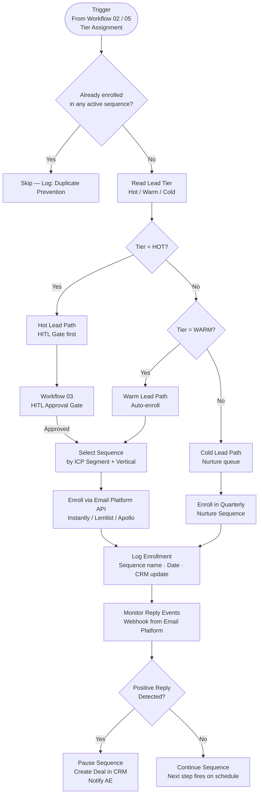
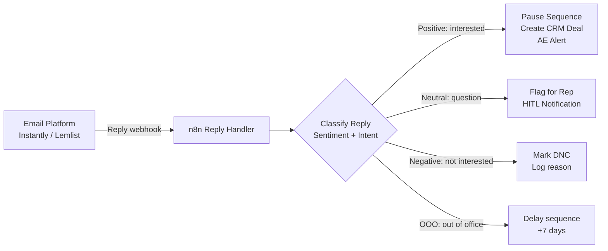

# Workflow 04: Outbound Sequence Trigger
**n8n Revenue Automation Library | myAutoBots.AI**

Auto-enrolls scored and tiered leads into appropriate email sequences based on ICP segment, lead tier, and company vertical. Prevents duplicate enrollment, handles sequence selection logic, and monitors reply events to pause sequences on positive response.

---

## Flow Diagram

---

## Sequence Selection Matrix

| Tier | ICP Segment | Sequence | Steps | Cadence |
|---|---|---|---|---|
| HOT | B2B SaaS | `saas-hot-6step` | 6 emails | Days 1, 3, 5, 8, 14, 21 |
| HOT | E-commerce | `ecom-hot-5step` | 5 emails | Days 1, 2, 4, 7, 14 |
| WARM | B2B SaaS | `saas-warm-8step` | 8 emails | Days 1, 4, 8, 12, 18, 25, 32, 45 |
| WARM | E-commerce | `ecom-warm-7step` | 7 emails | Days 1, 3, 7, 12, 21, 30, 45 |
| COLD | Any | `nurture-quarterly` | 4 emails | Days 1, 30, 60, 90 |

---

## Duplicate Prevention Logic

Before any enrollment, the workflow checks:
1. Is the lead currently active in any sequence? (API check to email platform)
2. Has the lead been enrolled and completed this exact sequence in the last 90 days?
3. Is the lead marked "Do Not Contact" or "Unsubscribed" in CRM?

All three checks must pass before enrollment proceeds.

---

## Reply Monitoring

---

## Node Reference

| # | Node | Purpose |
|---|---|---|
| 1 | Trigger Webhook | Receives tier assignment from Workflow 02/05 |
| 2 | Duplicate Check | HTTP Request to email platform API |
| 3 | Tier Router | Switch node — routes Hot/Warm/Cold |
| 4 | HITL Gate Call | HTTP Request to Workflow 03 (Hot only) |
| 5 | Sequence Selector | Function — maps ICP segment + tier to sequence ID |
| 6 | Enrollment API | HTTP Request to email platform |
| 7 | CRM Logger | HubSpot/Salesforce — logs enrollment metadata |
| 8 | Reply Webhook | Receives reply events from email platform |
| 9 | Sentiment Classifier | AI node — classifies reply intent |
| 10 | Sequence Pauser | HTTP Request to email platform — pause on positive |
| 11 | Deal Creator | HubSpot/Salesforce — creates deal on positive reply |

---

*Part of the [Neural-GTM Sprint](https://github.com/ssam8005/neural-gtm-sprint) methodology.*
