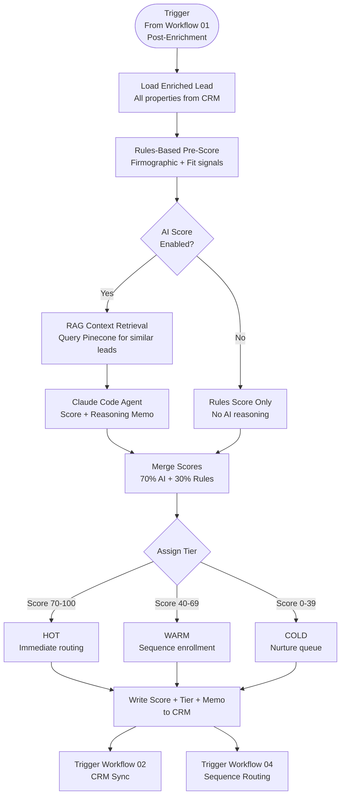
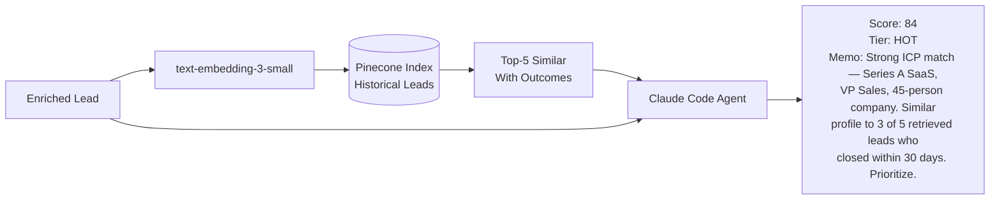

# Workflow 05: Intent Scoring Pipeline
**n8n Revenue Automation Library | myAutoBots.AI**

The most advanced workflow in the library. Scores every enriched lead 0–100 using a multi-signal model: enrichment data, behavioral signals, and a RAG-backed AI reasoning agent that retrieves context from prior deal history. Outputs a tier (Hot/Warm/Cold), a score, and a natural-language reasoning memo visible to reps in CRM.

---

## Flow Diagram



---

## Scoring Model — Signal Weights

### Rules-Based Component (30% of final score)

| Signal | Weight | Data Source |
|---|---|---|
| ICP industry match | 25% | Enrichment — company industry |
| Company size in target range | 20% | Enrichment — employee count |
| Title / seniority match | 25% | Enrichment — job title |
| Tech stack signals | 15% | Enrichment — technographics |
| Inbound vs outbound source | 15% | CRM — lead source field |

### AI Reasoning Component (70% of final score)

The RAG-backed Claude Code agent:

1. Embeds the enriched lead record
2. Queries Pinecone for the top-5 most similar historical leads
3. Retrieves their outcomes: closed, churned, ghosted, timing objection
4. Reasons across the current lead + retrieved context to produce a 0–100 score and a 2–3 sentence reasoning memo



---

## RAG Index Schema

Each historical lead stored in Pinecone includes:

```json
{
  "id": "deal-00423",
  "vector": [0.023, -0.412, ...],
  "metadata": {
    "industry": "B2B SaaS",
    "company_size": "45",
    "title": "VP Sales",
    "outcome": "closed_won",
    "days_to_close": 28,
    "deal_value": 24000,
    "objections": ["timing", "budget_cycle"],
    "close_signals": ["funding_event", "rep_change"]
  }
}
```

---

## Reasoning Memo — Example Output

```
Score: 84/100 | Tier: HOT

Reasoning: Strong ICP alignment — Series A SaaS company (42 employees),
VP Sales with 3 years tenure, HubSpot + Apollo stack detected. Retrieved
context: 3 of 5 most similar historical leads were closed-won, average 26
days to close. Common close signal: funding event within 90 days (present
here — $4.2M raised 7 weeks ago). Recommend same-day outreach with funding
congratulations angle.

Recommended sequence: saas-hot-6step
Suggested opening angle: Post-funding pipeline velocity
```

---

## Node Reference

| # | Node | Type | Purpose |
|---|---|---|---|
| 1 | Trigger | Webhook | Receives post-enrichment lead from Workflow 01 |
| 2 | Load CRM Record | HubSpot/Salesforce | Fetches all properties for scoring |
| 3 | Rules Scorer | Function | Calculates firmographic score (0–100) |
| 4 | AI Gate | IF | Checks `ai_scoring_enabled` config flag |
| 5 | Embed Lead | HTTP Request | Calls OpenAI embeddings API |
| 6 | Pinecone Query | HTTP Request | Top-K vector similarity query |
| 7 | Claude Agent | HTTP Request | Posts to scoring agent webhook (agentic-lead-scoring repo) |
| 8 | Score Merger | Function | Weighted blend: 70% AI + 30% rules |
| 9 | Tier Assigner | Switch | Maps score to Hot/Warm/Cold |
| 10 | CRM Writer | HubSpot/Salesforce | Writes score, tier, memo to CRM properties |
| 11 | Downstream Triggers | HTTP Request × 2 | Kicks off Workflow 02 (sync) and Workflow 04 (routing) |

---

## Configuration

```json
{
  "ai_scoring_enabled": true,
  "ai_weight": 0.70,
  "rules_weight": 0.30,
  "hot_threshold": 70,
  "warm_threshold": 40,
  "pinecone_index": "lead-intelligence",
  "pinecone_top_k": 5,
  "scoring_agent_webhook": "{{ $env.SCORING_AGENT_URL }}",
  "llm_model": "claude-3-5-sonnet-20241022"
}
```

---

*Part of the [Neural-GTM Sprint](https://github.com/ssam8005/neural-gtm-sprint) methodology.*
*AI scoring agent implementation: [agentic-lead-scoring](https://github.com/ssam8005/agentic-lead-scoring)*
